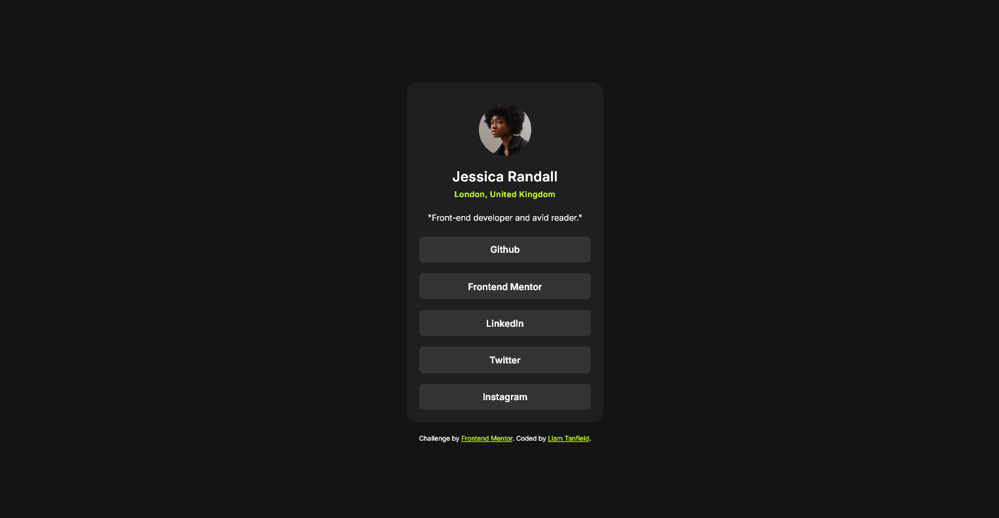
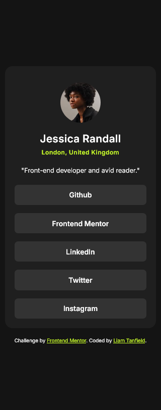

  

  <h1 align="center">Social Links Profile</h1>
  

    <a href="https://www.frontendmentor.io/challenges/social-links-profile-UG32l9m6dQ"><strong>Social Links Profile</strong></a>
     
     
    <a href="https://spontaneous-florentine-6d120e.netlify.app/">View Demo</a>
    ·
    <a href="https://www.frontendmentor.io/solutions/social-links-profile-scss-qoKQXm091i" target="_blank">Leave a comment</a> 
  

<!-- Badges -->

  <!-- Profile -->
  
  <!-- Status -->
    

#

This is a solution to the [Social Links Profile](https://www.frontendmentor.io/challenges/social-links-profile-UG32l9m6dQ). Frontend Mentor challenges help you improve your coding skills by building realistic projects.

<h2 align="center">Links</h2>

- Solution URL: [https://www.frontendmentor.io/solutions/social-links-profile-scss-qoKQXm091i](https://www.frontendmentor.io/solutions/social-links-profile-scss-qoKQXm091i)
- Live Site URL: [https://spontaneous-florentine-6d120e.netlify.app/](https://spontaneous-florentine-6d120e.netlify.app/)

 

## Table of contents

- [Overview](#overview)
  - [The challenge](#the-challenge)
- [My process](#my-process)
  - [Built with](#built-with)
- [Author](#author)

## Overview

### The challenge

Users should be able to:

- View the optimal layout depending on their device's screen size
- See hover and focus states for all interactive elements on the page

## My process

I will start with the style-guide.md file. Then I will try to gauge what fonts and units were used in which areas awhile making my custom properties.

This has been the first project I have done in a little while, a mix of health problems and moving house another time set me back a little bit over the last few months but I am back on working my skills, I have also been learning Javascript in the mean time and now feel ready to get some JS projects under my belt! 

Overall, this project felt straight-forward and fun to do!

### Built with

<!-- Badges -->

 // 

- Semantic HTML5 markup
- [SCSS (Sass)](https://sass-lang.com/) // Pure CSS3
- [Prettier (CSS Formatter)](https://prettier.io/)
- [Visual Studio Code (Editor)](https://code.visualstudio.com/)

## Author

- Frontend Mentor - [@TanDevv](https://www.frontendmentor.io/profile/TanDevv)
